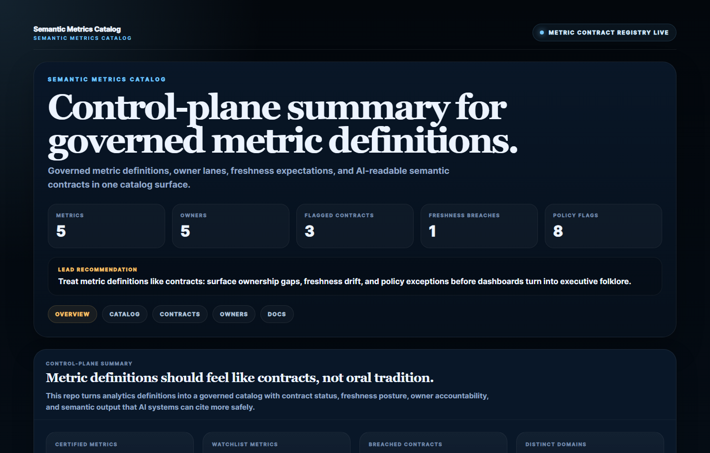
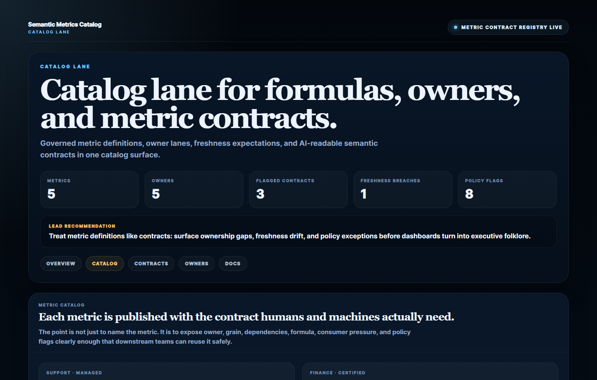
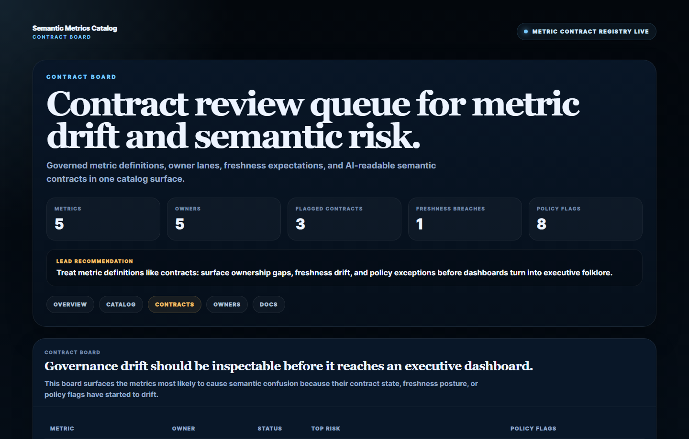
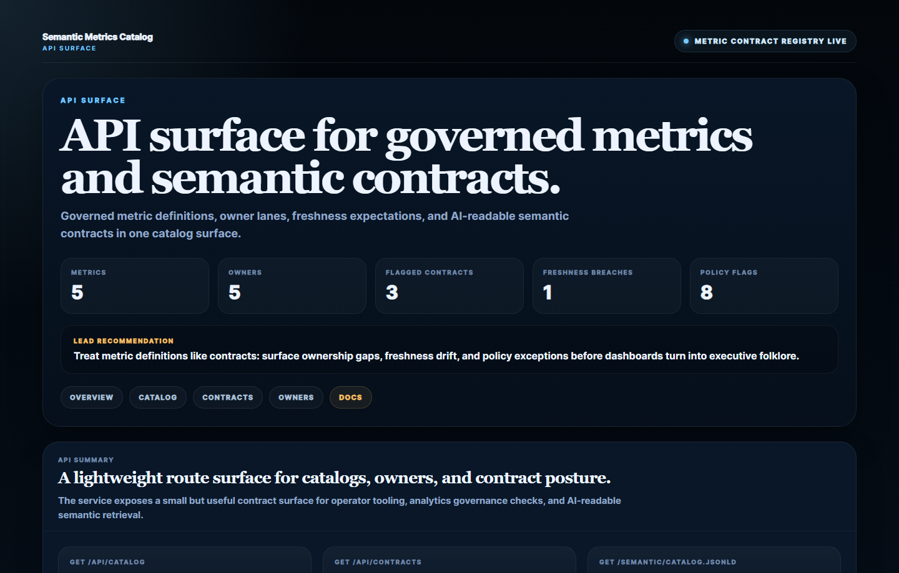
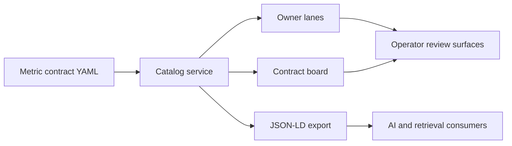

# Semantic Metrics Catalog

Governed metric catalog for **semantic contracts, ownership lanes, freshness posture, and AI-readable analytics definitions**.

> **What this repo proves**
>
> Analytics definitions become much safer when every KPI carries an explicit owner, contract state, freshness expectation, and semantic export surface instead of living as dashboard folklore.

## Why this repo exists

Most teams can name their key metrics faster than they can explain them. That
gap is where analytics debt grows:

- the same KPI label means different things across teams
- freshness expectations are implied instead of enforced
- ownership gets fuzzy once a metric spreads beyond one dashboard
- AI systems answer confidently from screenshots and stale wiki fragments

`semantic-metrics-catalog` models the missing control surface. It treats metric
definitions as governed products with status, versioning, lineage pressure, and
machine-readable publication.

## Screenshots

### Overview



### Catalog Lane



### Contract Board



### API Summary



## What it includes

- FastAPI service for governed metric catalog routes
- sample metric contracts across revenue, finance, product, support, and lifecycle
- owner lane and contract review surfaces
- JSON-LD `DataCatalog` export for AI-readable semantic retrieval
- real HTML proof scenes and PNG screenshots generated from the repo
- changelog, origin story, docs, tests, and CI

## Local run

```powershell
Set-Location "C:\Users\chaus\dev\repos\semantic-metrics-catalog"
py -3.11 -m venv .venv
.\.venv\Scripts\python.exe -m pip install -r requirements.txt
.\.venv\Scripts\python.exe -m app.main
```

Open:

- [http://127.0.0.1:4994/](http://127.0.0.1:4994/)
- [http://127.0.0.1:4994/catalog](http://127.0.0.1:4994/catalog)
- [http://127.0.0.1:4994/contracts](http://127.0.0.1:4994/contracts)
- [http://127.0.0.1:4994/owners](http://127.0.0.1:4994/owners)
- [http://127.0.0.1:4994/docs](http://127.0.0.1:4994/docs)

If that port is occupied:

```powershell
$env:PORT = "4998"
.\.venv\Scripts\python.exe -m app.main
```

## Validation

```powershell
Set-Location "C:\Users\chaus\dev\repos\semantic-metrics-catalog"
.\.venv\Scripts\python.exe -m unittest discover -s tests
.\.venv\Scripts\python.exe scripts\run_demo.py
.\.venv\Scripts\python.exe scripts\smoke_check.py
.\.venv\Scripts\python.exe scripts\render_readme_assets.py
```

## API routes

- `GET /api/dashboard/summary`
- `GET /api/catalog`
- `GET /api/metrics`
- `GET /api/metrics/{metric_name}`
- `GET /api/contracts`
- `GET /api/owners`
- `GET /api/sample`
- `GET /semantic/catalog.jsonld`

## Example metric contract

```json
{
  "name": "net_revenue_retention",
  "owner": "Finance Analytics",
  "contract_status": "watch",
  "freshness_status": "within_sla",
  "contract_version": "1.8"
}
```

## Architecture



More detail lives in [C:\Users\chaus\dev\repos\semantic-metrics-catalog\docs\architecture.md](/C:/Users/chaus/dev/repos/semantic-metrics-catalog/docs/architecture.md).
